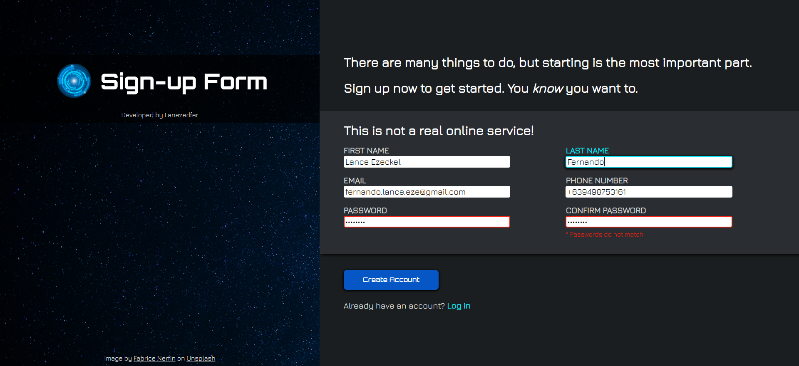

# sign-up-form
__sign-up-form__ is a personal project developed as part of the [__Intermediate HTML and CSS__](https://www.theodinproject.com/lessons/node-path-intermediate-html-and-css-sign-up-form) course from [__The Odin Project__](https://www.theodinproject.com).

### This personal project was undertaken to learn and practice the following:
* BEM (Block - Element - Modifier) Methodology
* CSS Custom Properties and `:root` Selector
* CSS Reset
* Flexbox Layout
* HTML Favicon
* HTML Forms and Inputs

## Features
* Client-side Form Validation
* Interactive User Interface
* Responsive Web Design

## Preview

  
  <a href="https://lanezedfer.github.io/sign-up-form/">Link to Live Preview</a>

# Acknowledgements
### Course:
* [__The Odin Project__](https://www.theodinproject.com/about)

### Fonts Used:
* [__Jura__](https://fonts.google.com/specimen/Jura/about)
* [__Orbitron__](https://fonts.google.com/specimen/Orbitron/about)

### Image Used:
* [__Nebula Galaxy__](https://unsplash.com/photos/nebula-galaxy-puHQJZd3MDg) by [__Fabrice Nerfin__](https://unsplash.com/@fabiolik)

# License
This project is distributed under the MIT License. View [`LICENSE.txt`](LICENSE.txt) for more information.

# Author
* Lance Ezeckel P. Fernando (fernando.lance.eze@gmail.com)